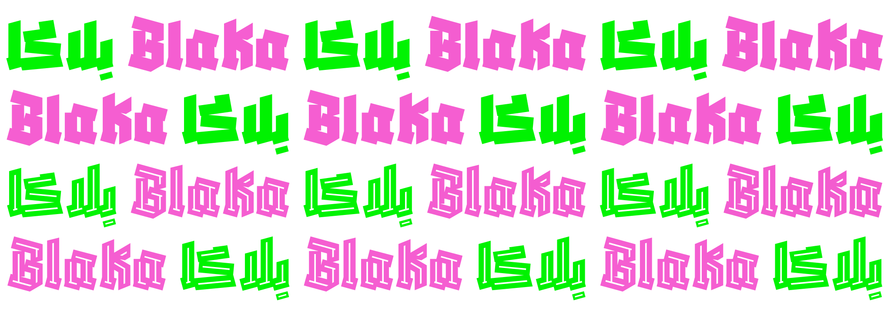

# Blaka


<b>Blaka</b> is an experimental typeface, enriching the gothic feeling of [blackletter][1] by enhancing the geometric features to create midgrounds with the Arabic [Kufic][2] style for the Arabic letterforms. 

The aesthetical matching process between the two scripts relies on the features of a being hand-drawn with a reed pen. While Latin letterforms maintain sharp edges, Arabic relies on sharp edges and thick strokes to create overlaps to replace a usual baseline in most letterforms, giving the Arabic letterforms contemporary features. 

The font family comes in two styles, Blaka and Blaka-Holo, featuring an outlined version of the font. Blaka also comes in two variants, the usual monochrome variants as well as an Ink variant <b>"Blaka-Ink"</b>. The Ink variants are [color fonts][3] where the colors are defined by the font itself. Support for color font is currently limited to few applications like Google Chrome (version 98 or later) and [FontGoggles][4] (version 1.4.0 or later).

[1]: https://en.wikipedia.org/wiki/Blackletter
[2]: https://en.wikipedia.org/wiki/Kufic
[3]: https://developer.chrome.com/blog/colrv1-fonts/
[4]: https://fontgoggles.org/


# Build

Black and Hollow are combined in the same source file, but they can't currently be generated by `fontmake` like that because they are not interpolatable which `fontmake` expects. To keep the single source file, make changes to the single source file and export the separate `.glyphs` temporary sources using the following script from within Glyphs.app:

```python
import os
for instance in Glyphs.font.instances:
	font = instance.interpolatedFont
	font.familyName += " " + instance.name
	font.familyName = font.familyName.replace("Regular", "").strip()
	font.instances[0].name = "Regular"
	font.save(os.path.join(os.path.dirname(Glyphs.font.filepath), "temp", font.familyName.replace(" ", "") + "-Regular.glyphs"))
print("done")
print(f"Note: As of this writing, Glyphs won't put the app build number into the sources when generating isntances like we just did above. This breaks generating the fonts with glyphsLib. Please do add the build number {int(Glyphs.buildNumber)} into the source files with a text editor at the top of the file under .appVersion = \"\"; to be .appVersion = \"{int(Glyphs.buildNumber)}\"; The author of Glyphs has been notified. Once you find that the build number does automatically appear in the sources, you may delete this print statement.")
```
